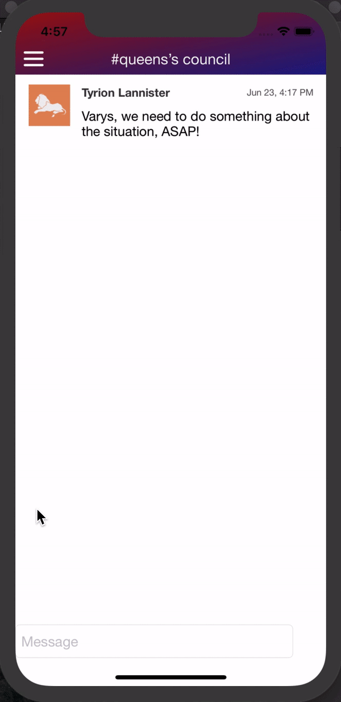

# Whack chat app
A complete iOS chat app developed using [mac-chat-api](https://github.com/devslopes-learn/mac-chat-api) by Devslopes.

## Working of the app
* Create an account
* Choose an avatar
* Choose a background color for your avatar
* Create different channels
* Send and receive messages
* See if other personis typing a message

## Build with
* Xcode 10.1 and Swift 4.2 for development of the app
* [Alamofire](https://github.com/Alamofire/Alamofire) (4.8.2)
* [Socket IO Client Swift](https://github.com/socketio/socket.io-client-swift) (15.0.0)
* [SwiftyJSON](https://github.com/SwiftyJSON/SwiftyJSON) (5.0.0)
* [SWRevealViewController](https://github.com/John-Lluch/SWRevealViewController)

## Some gifs of the app in action

Create new account                  |  Pick an avatar                   |  Create new channel                 |  Check profile and logout
:----------------------------------:|:---------------------------------:|:-----------------------------------:|:---------------------------------:
  |    |   | 

